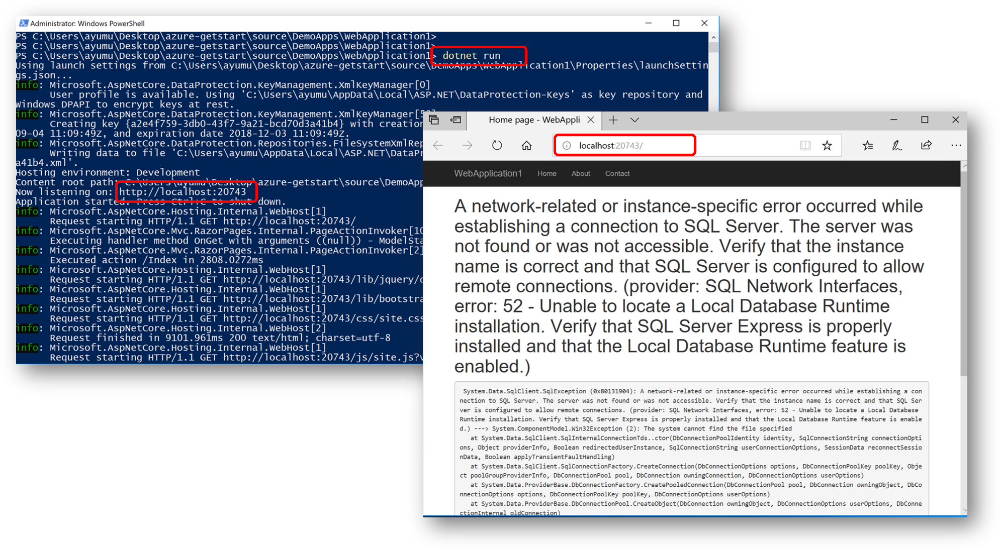

# ハンズオン環境の構築

本ドキュメントはハンズオンを実施するために必要な環境を構築するための説明資料です。

## 前提環境

ハンズオン参加者はご自身の Windows 10 クライアントをご用意ください。本ドキュメントの作成および環境確認には Windows 10 April 2018 Update (Version 1803) を使用しています。


リリースバージョンの詳細については
[こちら](https://www.microsoft.com/ja-jp/itpro/windows-10/release-information)
をご参照ください。


## Linux シェル環境 のインストール

ハンズオンでは Linux シェルを使用したり、Azure 仮想マシンへ SSH 接続をする必要があります。
ここでは Windows Subsystem for Linux および Ubuntu 環境をインスールして利用します。

### Windows Subsystem for Linux のインストール

まず **Windows の機能の有効化または無効化** より Windows Subsystem for Linux をインストールします。


インストールが完了したら機能を有効にするために一度 Widnwos を再起動してください。

### Windows Subsystem for Linux のインストール

続いて Microsoft ストアから 
[Ubuntu をインストール](https://www.microsoft.com/store/productId/9NBLGGH4MSV6)
します。


インストール完了後に Ubuntu を起動すると、管理者のユーザー名とパスワを入力してください。

### 補足
より詳細な手順が必要な場合は
[こちら](http://www.atmarkit.co.jp/ait/articles/1608/08/news039.html)
などをご参照ください。


## Git クライアントのインストール

ハンズオンで使用する手順書やアプリケーションのソースコードは GitHub に格納されていますので、
[Git for Windows](https://gitforwindows.org/) 
をインストールしておくと便利です。
インストールウィザードで表示される選択肢は全て既定のオプションで構いません。

インストールが完了したら PowerShell やコマンドプロンプトから Git コマンドが実行できることを確認します。


### ハンズオン資源のダウンロード

ハンズオン資源一式はローカルにダウンロードしておくとよいでしょう。PowerShell やコマンドプロンプトでデスクトップ等の作業フォルダに移動し、以下のコマンドを実行します。

```
PS > git clone https://github.com/ayuina/azure-getstart
```

Clone コマンドの完了後、リポジトリ名のサブディレクトリの中身を確認してダウンロードされていることを確認します。


### 補足
インストール方法、Git コマンド、GitHub についてより詳細な手順や解説が必要な場合は
[こちら](http://www.atmarkit.co.jp/ait/articles/1603/31/news026.html)
などが参考になるでしょう。


## アプリケーションランタイムおよび SDK のインストール

サンプルコードは ASP.NET Core アプリケーションとして作成されています。
このためサンプルコードのビルドおよび実行には 
[.NET Core SDK](https://www.microsoft.com/net/download)
 が必要です。


### サンプルアプリケーションの実行

ソースコードレポジトリ配下の以下のディレクトリに ASP.NET Core で作成された Web アプリケーションのソースコードが配置されています。

```
/source/DemoApps/WebApplication1
```

PowerShell のカレントディレクトリを上記まで移動して `dotnet run` コマンドを実行することで Web アプリケーションが開始します。
出力テキスト内に Web アプリケーションが待機する URL が表示されていますので、ブラウザでアクセスして確認してみましょう。



データベースを構築していませんので、SQL エラーが出ていることは問題ありません。


## コンテナ環境のインストール

サンプルアプリケーションを Docker コンテナ上で動作させることも出来ますので、
[Docker for Windows](https://docs.docker.com/docker-for-windows/)
もインストールしておくと良いでしょう。


### コンテナアプリの実行

サンプルアプリケーションから Docker イメージを作成するための Dockerfile が本レポジトリないの下記ディレクトリに格納してあります。

```
/deploy/linux/container
```

PowerShell で当該ディレクトリを開き以下のコマンドを実行すると Linux コンテナ内でアプリケーションを実行することが出来ます。


## 統合開発環境のインストール

ハンズオンでは基本的にアプリケーションのソースコードそのものは扱いませんが、ファイルの参照や修正のためにテキストエディタがあると良いでしょう。
ここでは
[Visual Studio Code](https://code.visualstudio.com/)
 を利用することにします。


インストールオプションは既定値のままでも構いませんが、Windows エクスプローラでファイルやフォルダのコンテキストメニューから VSCode で開けるようにしておくと便利です。

先ほど GitHub レポジトリからクローンしたフォルダを VSCode で開くと以下のようになります。


VSCode の統合ターミナルを開くと PowerShell が使用でき、そこからこれまでインストールしてきた  Bash、Git、.NET Core、Docker などといったツールを起動することが可能になります。
