# IaaS で作る Web+DB システム

本ドキュメントは Azure 初学者向けハンズオン用の資料です。学習用のために実際のシステム構築では通常は行わないような構成・作業手順を行っている場合があります。

## リソースグループの作成

Azure ポータルの「リソースの作成」より「リソースグループ」を検索し、リソーグループを作成します。

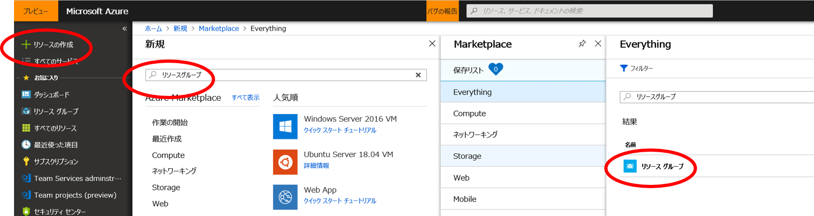

- リソースグループ名
    - 現在作業中の環境が複数人で共用する、本ハンズオン以外の他の用途にも使用するなどの場合、リソースグループ名は日付や自分の名前を含めるなどして区別がつきやすいようにすることをおススメします。
- サブスクリプション
    - 本ハンズオンのこの作業を進めていくと仮想マシン等の有料のリソースを作成しますので、使っても良いサブスクリプションが選択されているか確認しましょう。
- リソースグループの場所
    - ここでは任意のリージョンを選択しても構いません。


## 仮想ネットワークの作成

Azure ポータルの「リソースの作成」、もしくは、先ほど作成したリソースグループの「追加」より、仮想ネットワークを作成します。

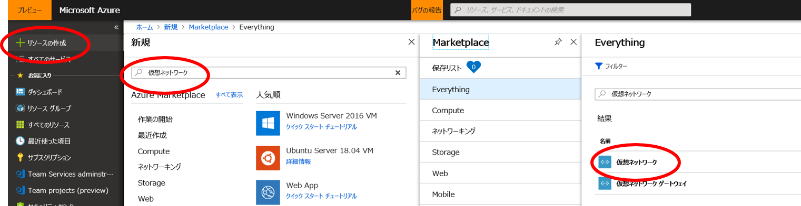

- 名前
    - この先の操作で仮想ネットワークは良く出てきますので、分かりやすい名前を付けましょう
- アドレス空間
    - ここでは CIDR 表記で /24 bit 程度 のアドレス空間を定義します。プライベートアドレス空間を使用しましょう。
- サブスクリプション
    - 適切なサブスクリプションが選択されていることを確認しましょう。
- リソースグループ
    - 「既存のものを使用」を選択し、先ほど作成したリソースグループを選択します。
- 場所
    - ここでは適切なリージョン、すなわち、システムを稼働させるリージョンを選択します。リソースグループと異なるリージョンを選択しても構いません。
- サブネット
    - 上述のアドレス空間の中から複数のサブネットを切ることが出来ます。ここでは Web サーバー用のサブネットとして /27 bit のサブネットを作成しています。


### サブネットの追加

先ほど作成した仮想ネットワークを選択し、「サブネット」タブを選択すると、既にWebサーバー用のサブネットが作成されていることが確認できます。
ここでDB サーバー用の新しいサブネットとして /27 bit アドレス範囲のサブネットを追加します。

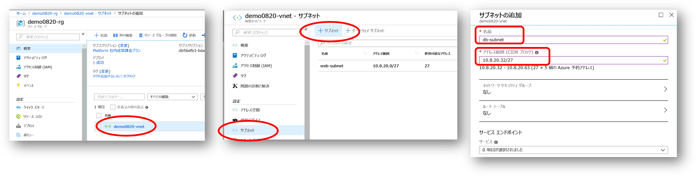


以降ではここで作成した仮想ネットワーク内の各サブネット内に仮想マシンを作成していきます。

## 仮想マシンの作成

ここでは Web サーバーを2台、DB サーバーを 1台作成します。
仮想マシンの作成には数分程度の時間がかかりますので、先に Azure ポータルからの全ての仮想マシン作成作業を済ませてしまい、
その後で各サーバー内のソフトウェア構成作業を行うと良いでしょう。

### Webサーバー 1号機用 Windows 仮想マシンの作成

先ほど作成したリソースグループの「追加」より、仮想マシンを追加します。ここではマーケットプレイスにセットアップ済みイメージが提供されている Windows Server 2016 を使用します。

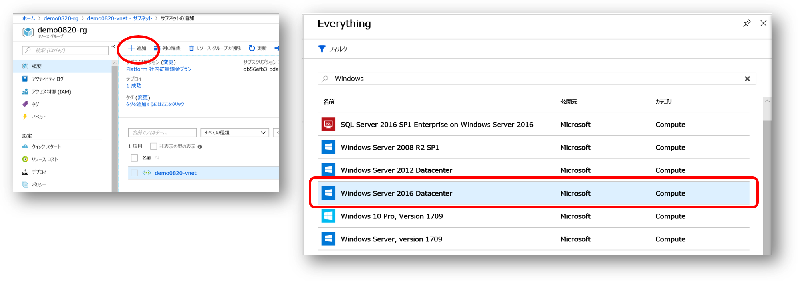

選択した仮想マシンイメージに応じて構成画面が用意されているので必要事項を入力します。

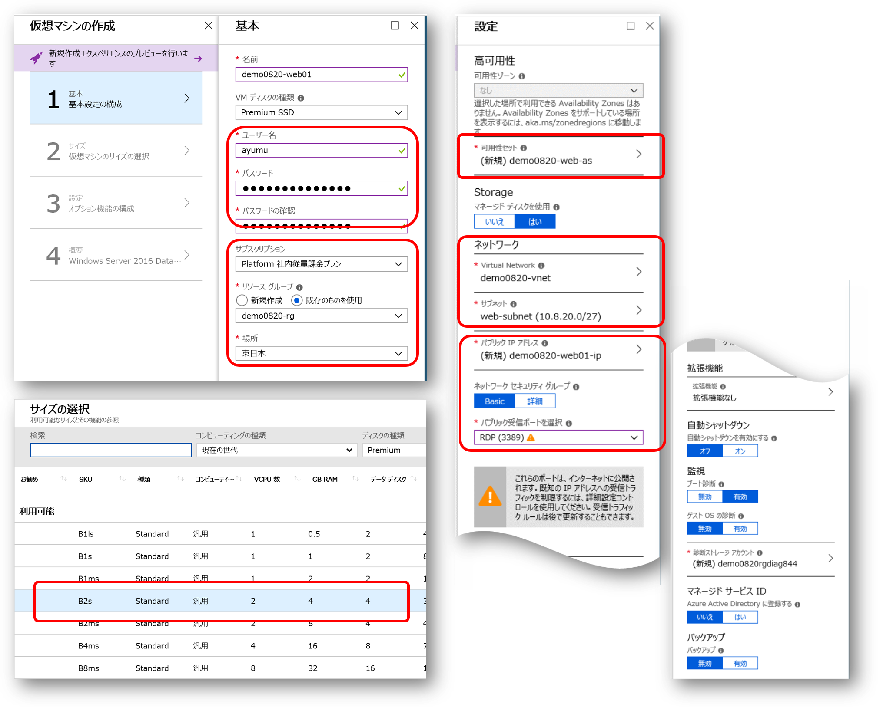

- 基本
    - Windows にログオンするための管理者のユーザー名とパスワードを指定します。後程リモートデスクトップで接続するので忘れないようにしましょう。
    - サブスクリプション、リソースグループ、場所、はこれまで作成してきたものと一致させてください。
- サイズ
    - それほど高スペックを求められるわけでもないので、ここでは料金の安い Bシリーズを選択しています。あとで変更も可能です。
- 設定
    - ここで可用性セットを新規に作成します。もう一台の Web サーバーで同じものを使うのでわかりやすい名前を付けてください。障害ドメインや更新ドメインは既定値のままで問題ありません。
    - 仮想ネットワークやサブネットには前述の手順で作成したものを選択します。
    - パブリック IP アドレスを新規に作成することで、インターネット経由で仮想マシンに接続することができるようになります。加えて管理操作に使用するリモートデスクトップ用のプロトコルが通るようにネットワークセキュリティグループを構成します。

構成の検証の後に仮想マシンの作成が開始されますが、数分程度は時間がかかってしまうので、他の仮想マシンも並行して作成してしまいましょう。

### Webサーバー 2号機用 Linux 仮想マシンの作成

作成手順は基本的に Windows 版の仮想マシンと同じですが、ここではマーケットプレイスに公開されているイメージから Ubuntu Server を選択しています。

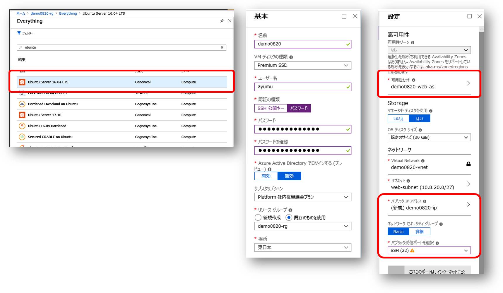

- 認証
    - Linux 仮想マシンの場合はパスワードではなく SSH キーを使用した認証も可能です。
- 可用性セット
    - 可用性セットは新規に作成せず、Web サーバー1号機の構築時に作成した可用性セットを選択します。
- ネットワーク
    - Web サーバー 1号機と同じ仮想ネットワークおよびサブネットを選択します。
- ネットワークセキュリティグループ
    - ２号機は Windows ではなく Ubuntu Linuxなので、管理操作に使用する SSH プロトコルが通るように ネットワークセキュリティグループを構成します。

### DBサーバー用 SQL Server インストール済み仮想マシンの作成

作成手順は基本的に Web サーバー用の仮想マシンと同じですが、ここではマーケットプレイスに公開されているイメージから SQL Server がインストールされた Windows Server イメージを選択しています。自分で SQL Server をインストールする手間が無いので構築作業がかなり楽になります。

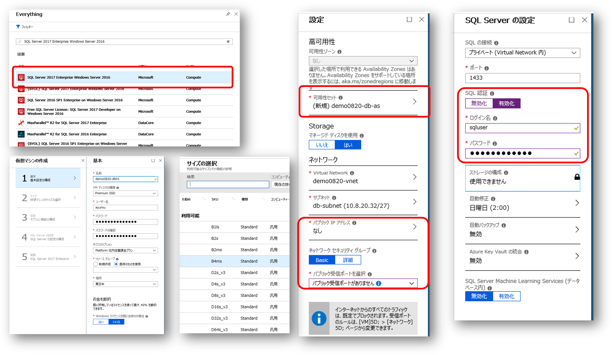

- 可用性セット
    - ここでは Web サーバー用とは異なる、新規の可用性セットを作成します。
- パブリック IP アドレス
    - DB サーバーはパブリック IP アドレスを割り当てません。
- ネットワークセキュリティグループ
    - パブリック IP アドレスを割り当てていませんので、ここでは 受信ポートも公開しません。
- SQL Server の設定
    - Windows Server 2016 用の仮想マシンイメージとは異なり、ここでは SQL Server をインストーする際の設定項目を指定することができます。
    - ここでは SQL 認証を有効にして、SQL ServerへのログインユーザーIDとパスワードを指定しています（Windows へログインする際のID／パスワードとは変えておくと良いでしょう）

### ここまでの作業内容の確認

リソースグループを参照すると、仮想マシンだけではないく、多数のリソースが作成されていることが分かります。

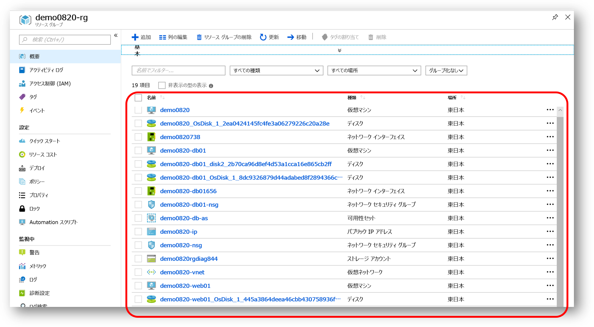

また仮想ネットワークを確認すると、ネットワークに接続された仮想マシンが確認できます。より正確には仮想マシンはネットワークインターフェイスを介して接続していますので、仮想マシンとは若干異なるデバイス名が表示されていることが分かります。仮想ネットワークは DHCP を使用してサブネットに指定されたアドレスレンジから ネットワーク インターフェイスにプライベート IP アドレスを割り当てます。仮想マシンが他のデバイスと通信する際にはこのネットワーク インターフェイスのアドレスを使用します。

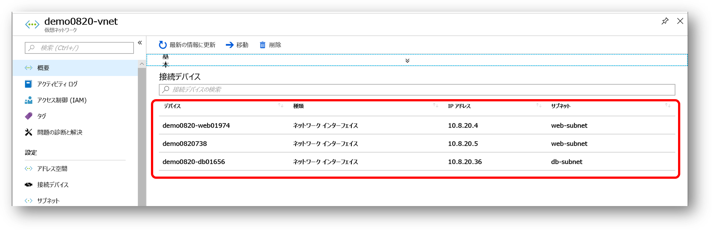


## ソフトウェアのセットアップ

以降では仮想マシン内で稼働する Windows や Linux に対する構成変更、並びにソフトウェアのインストールを実施しますので、Azure 特有の知識はあまり必要ありません。

### Web サーバー 1号機用 Windows 仮想マシンの構成

Azure 仮想マシンとしての構築が完了したら、仮想マシン内部のソフトウェアを構成します。Web サーバー 1 号機はパブリック IP アドレスを割り当て、リモートデスクトップ接続用のポートを開放しているので、インターネット経由で通常のリモートデスクトップクライアントを使用して接続することが可能です。

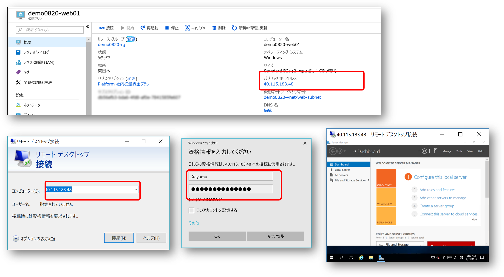

Azureポータル上で仮想マシンの「パブリック IP アドレス」を確認し、リモートデスクトップクライアントのコンピュータ名として入力します。接続ボタンを押下すると RDP ファイルがダウンロードできますので、そちらを使用しても構いません。リモートデスクトップ接続時の資格情報には Azure ポータルで構築時に入力したユーザー ID とパスワードを使用できますので、その先は通常の Windows サーバーと同じように操作が可能になります。

#### IE ESC の無効化

以降の手順では Internet Explorer を使用して動作確認を行います。初回ログイン時にはサーバーマネージャーが表示されますので、このタイミングで IE ESC を無効化しておくことをおススメします。
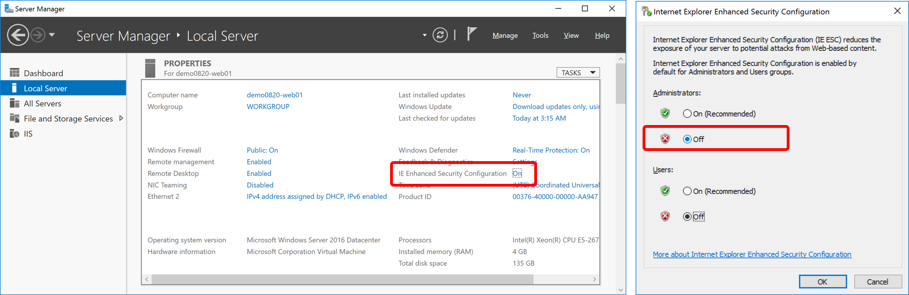

#### IIS のインストール
まずは Web サーバーとして構成するために IIS （Internet Information Service）をインストールします。まずPowerShell を起動して以下のコマンドを実行します。

```
PS > Install-WindowsFeature -Name Web-Server
```
インストールが完了したら正常に稼働していることを確認しましょう。以下のコマンドを実行すると Internet Explorer が起動して IIS の初期画面が表示されます。
```
PS > start http://localhost
```
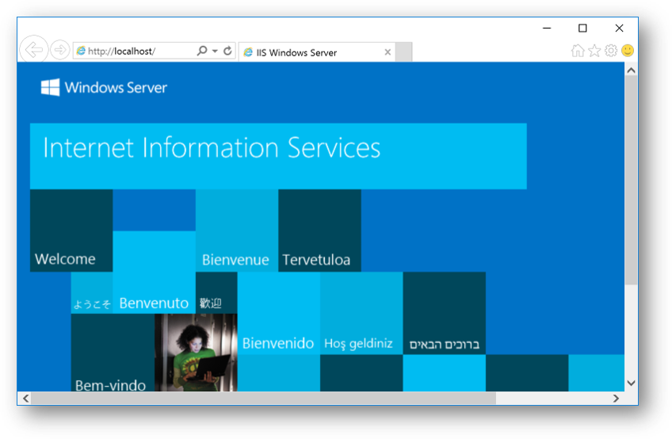

#### ASP.NET Core のインストール

次にアプリケーションサーバとして構成するためにミドルウェアの導入を行います。ここでは ASP.NET Core ベースのWebアプリケーションを構築するとしてて、
[こちら](https://www.microsoft.com/net/download/dotnet-core/runtime-2.0.7)
から v2.0.7 の Windows 版 ASP.NET Core Runtime & Hosting Bundle をダウンロードおよびインストールします。

インストールが完了したら念のため IIS を再起動しておきましょう。
```
PS > iisreset
```

#### アプリケーションのインストール

本ドキュメントが配置されているレポジトリにはサンプルアプリケーションのソースコードも併せて配置してあります。
```
/source/DemoApps
```
またビルド用のスクリプトは以下より取得できます。
```
/deploy/windows/local/publish.cmd
```

なお環境的な問題から自身でのビルドが難しい場合には、ビルド済みのバイナリを下記よりダウンロードしてください。
```
/deploy/windows/local/publish.zip
```

生成されたビルド済みバイナリファイルを Webサーバーに配置してやればアプリケーションが動作します。上記では全て既定の設定で構築したため、このサーバーのWebサイトルートは以下のディレクトリになります。

```
C:\intepub\wwwroot
```
このディレクトリには先ほど動作確認した時に表示されたHomeページ用のファイル（iisstart.*）が配置されていますが、この代わりにアプリケーションを配置してやればよいわけです。

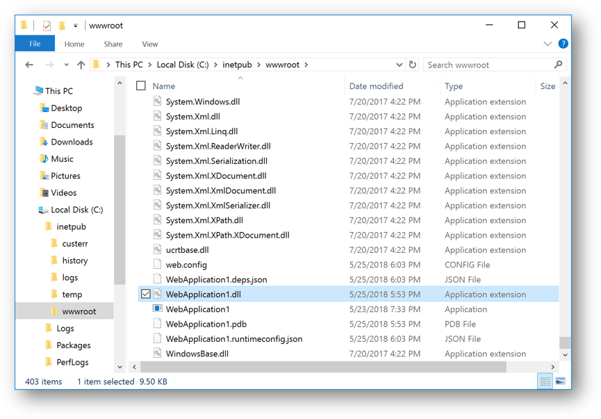

改めて Internet Explorer より動作確認をすると以下のような画面が表示されます。エラー画面が表示されますが、この段階では DB サーバーのセットアップを行っていませんので問題ありません。

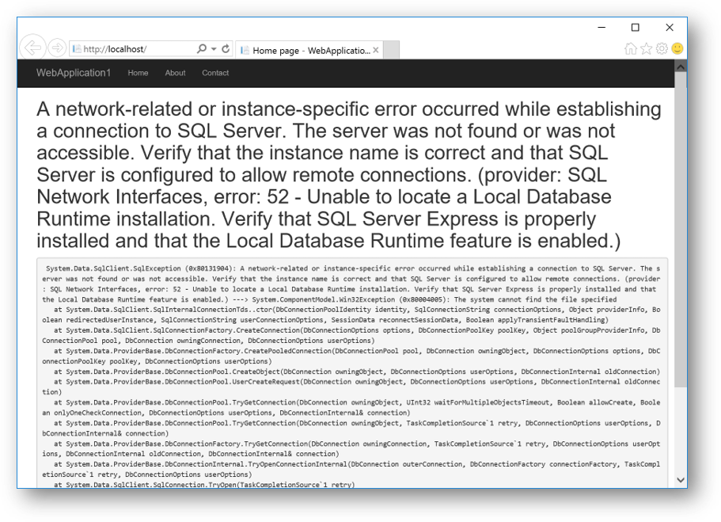

#### インターネットからアクセス

セットアップした Web サーバーはパブリック IP アドレスが割り当てられているますが、仮想マシン作成時に設定したネットワークセキュリティグループはリモートデスクトップ接続用のプロトコルしか許可していません。
ネットワークセキュリティグループにHTTP（ポート80）の受信許可を設定することで、インターネットに公開されたWebサーバーにすることができます。

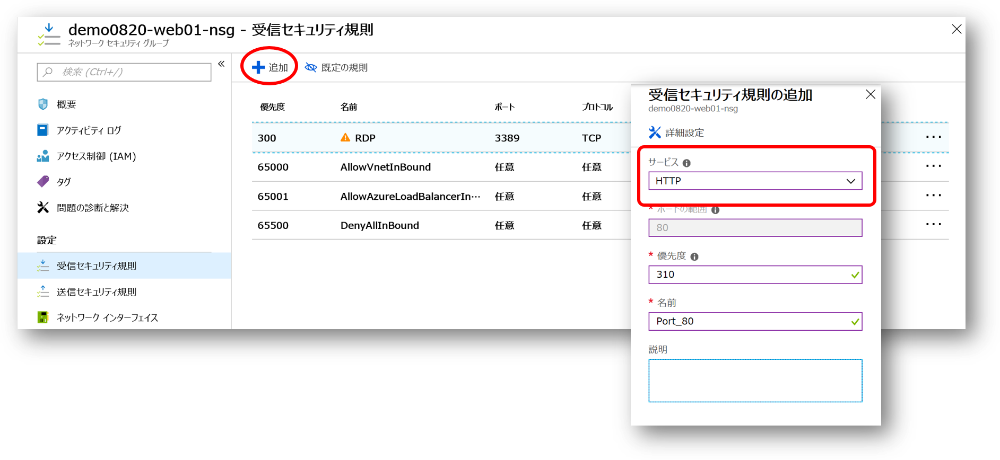

リモートデスクトップ接続に使用した IP アドレスを Web ブラウザに入力することで、下記のように同様のエラー画面を確認できます。

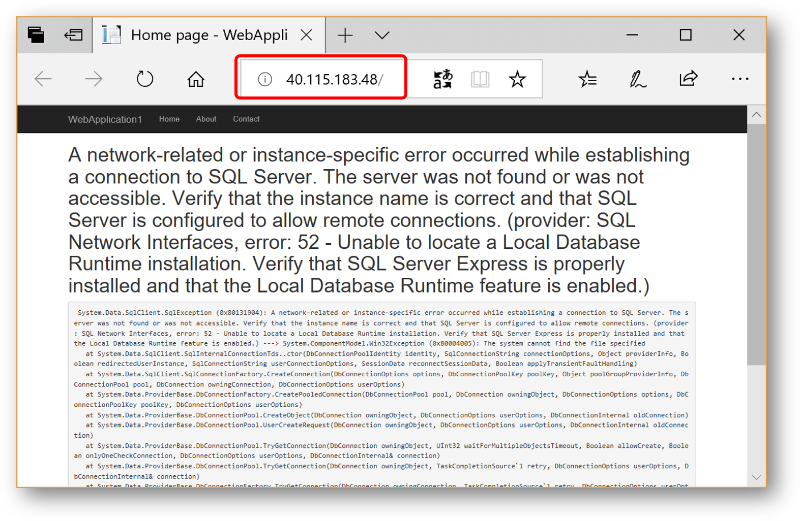

### Web サーバー 2号機用 Linux 仮想マシンの構成

Azure 仮想マシンとしての構築が完了したら、仮想マシン内部のソフトウェアを構成します。Web サーバー 2 号機はパブリック IP アドレスを割り当て、SSH 接続用のポートを開放しているので、インターネット経由で通常の SSH クライアントを使用して接続することが可能です。

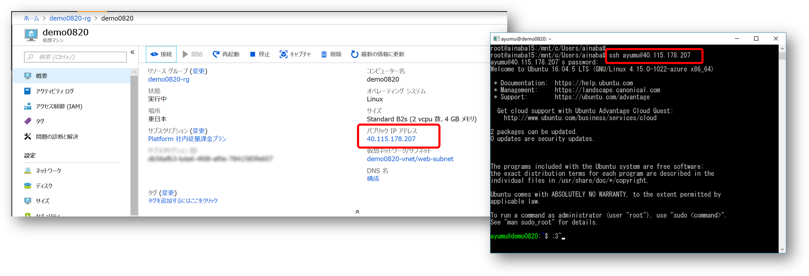

Azure ポータル上で仮想マシンの「パブリック IP アドレス」を確認し、SSH クライアントのコンピュータ名として入力します。SSH 接続時の資格情報には Azure ポータルで構築時に入力したユーザー ID とパスワードを使用できますので、その先は通常の Linux サーバーと同じように操作が可能になります。

#### Nginx のインストール

ここでは Web サーバーとして Nginx を使用しますので、以下のコマンドを実行してください。
⁉
```
$ sudo apt-get update
$ sudo apt-get install nginx
```
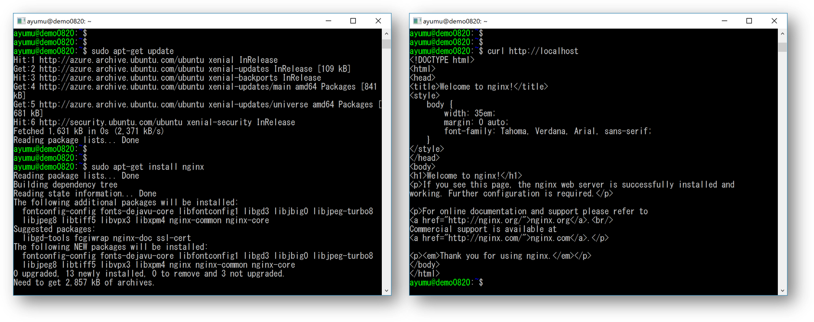

インストール処理が完了したら Web サーバーが稼働していることを確認しましょう。以下のコマンドを実行して問題なく HTML ファイルがダウンロード出来ることを確認します。

```
$ curl http://localhost
```

#### ミドルウェアとアプリケーションのセットアップ

サンプルアプリケーションは ASP.NET Core で実装されていますので、Linux サーバー上で動作させること自体は可能なのですが、本ハンズオンでは割愛します。

#### インターネットからアクセス

セットアップした Web サーバーはパブリック IP アドレスが割り当てられていますが、仮想マシン作成時に設定したネットワーク セキュリティ グループには SSH 接続用のプロトコルしか許可していませ”。
ネットワークセキュリティグループにHTTP（ポート80）の受信許可を設定することで、インターネットに公開されたWebサーバーにすることができます。

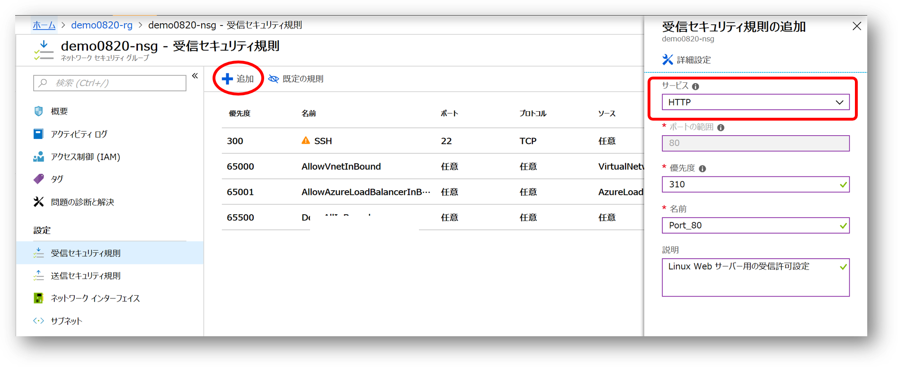

SSH 接続に使用した IP アドレスを Web ブラウザに入力することで、下記のように Nginx の初期画面を確認することができます。

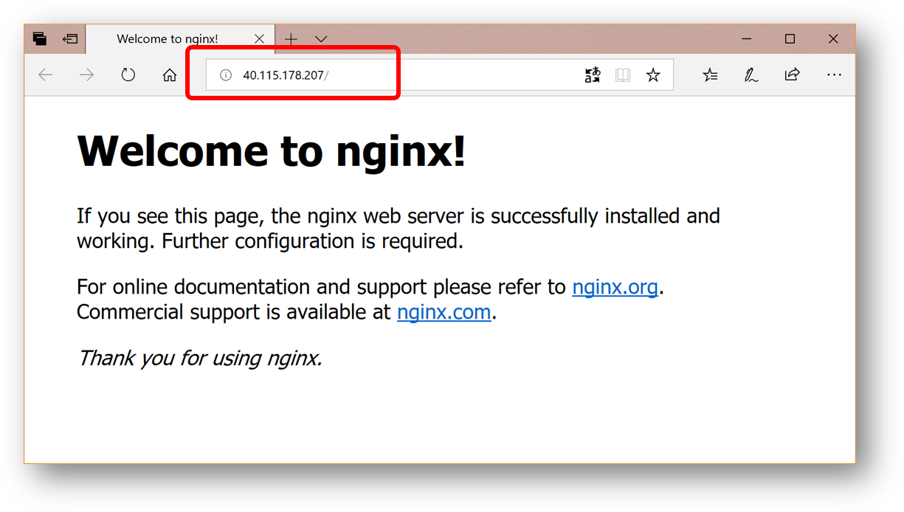


### DB サーバー用の Windows 仮想マシンの構成

DB サーバーはパブリック IP アドレスを割り当てていませんので、インターネットからの直接接続ができません。このため Web サーバー 1 号機を運用管理端末のような踏み台として利用します。

まずWeb サーバー 1 号機に接続しているリモートデスクトップ内で DB サーバー自体に PING を打ってみます。PING コマンド自体はタイムアウトしてしまっていますが、名前解決が出来ていることがわかります。

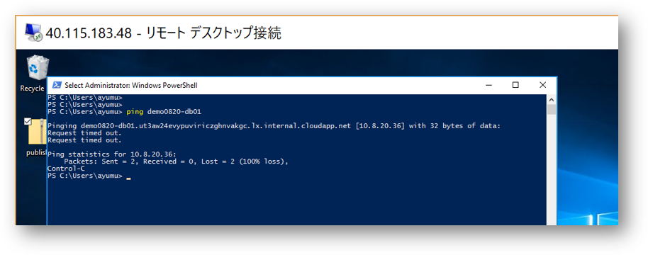

それではリモートデスクトップ接続をしてみましょう。この際 DB サーバーのリモート デスクトップ接続の画面サイズを、全画面ではなく少し小さめにしておくとこの先の操作が分かりやすくなります。


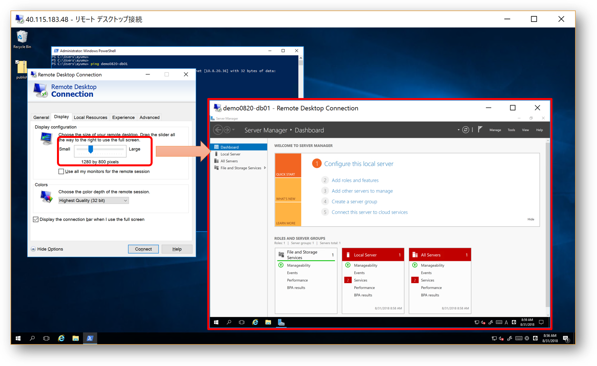

DB サーバーのリモートデスクトップ上でスタートメニューを開くと既に SQL Server がインストール済みであることが分かります。インストールされたツールの中から SQL Server Management Studio を起動します。

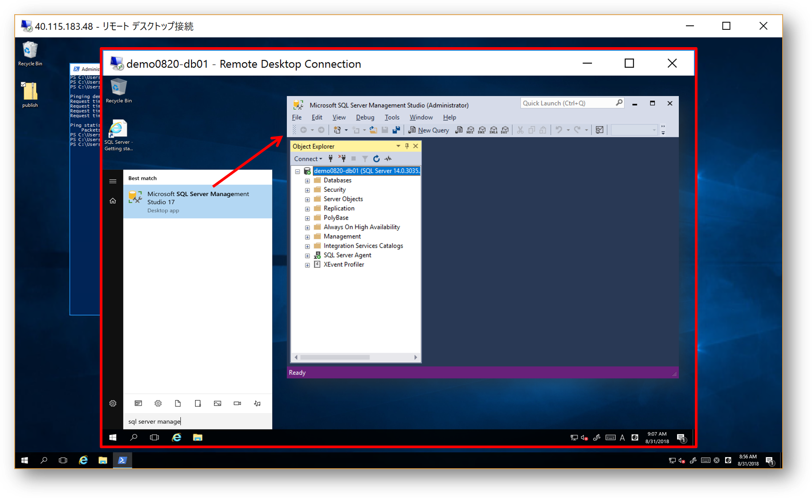


#### データベースの作成

SSMS (SQL Server Management Studio）の左ペインから "Databases" を右クリックして "New Database" を選択、適当な名前をつけて空のデータベースを作成します。

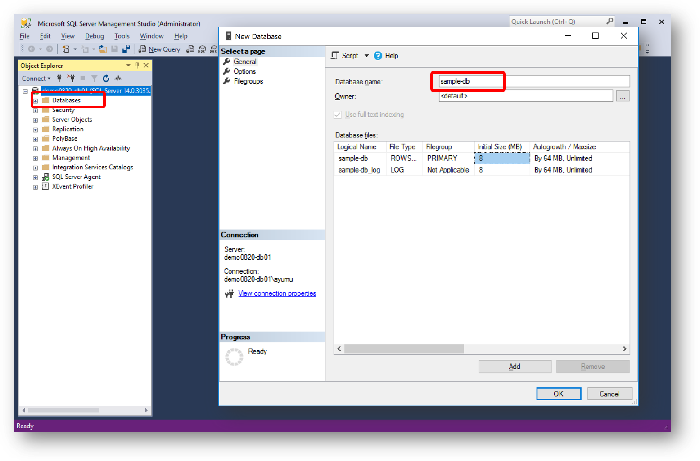

#### テーブル作成およびデータの投入

作成したデータベースを右クリックして "New Query" を選択します。クエリウィンドウ内で実行するクエリもソースコードレポジトリに含まれていますので、そちらからコピーしてください。

```
/source/DemoData/employee-table.sql
```

実行結果が分かりやすくなるように INSERT 文を若干加工してご自身の名前などを入れておくと良いでしょう。

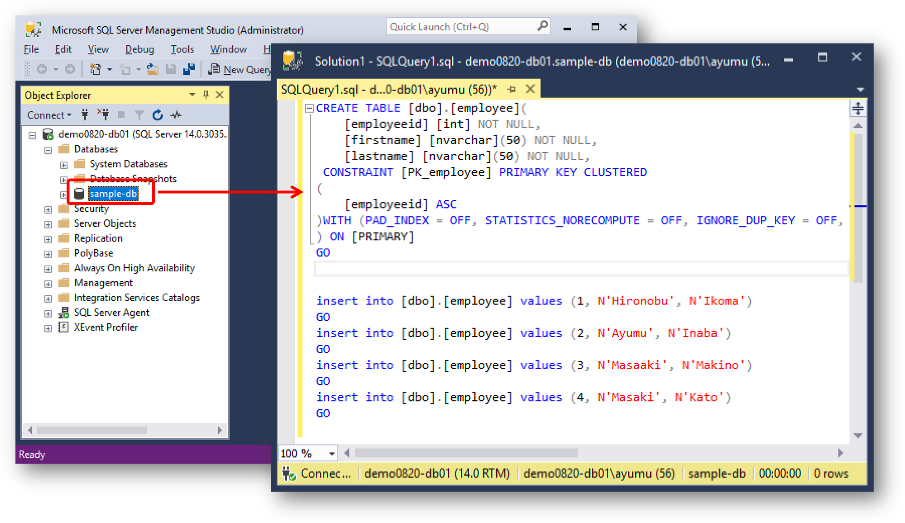


#### ユーザーアクセス権の設定

SSMS のサーバーレベルから "Security" → "Logins" と展開すると、Azure ポータルで構築した SQL Server のユーザーが登録されていることが分かります。このユーザーに対して作成したデータベースへアクセスする権限を付与する必要があります。

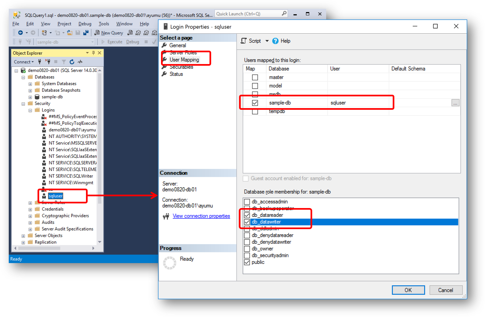

ユーザー名を右クリックして "Properties" を選択します。"User Mapping" タブで作成したデータベースをチェックし、"db_datareader" と "db_datawriter" 権限を付与します。


### Web アプリケーションから SQL Server への接続

データベースサーバー側の準備が出来たので、Web アプリケーションとデータベースを接続します。

#### アプリケーション構成設定の変更

Web サーバー 1号機のリモートデスクトップに戻り、先ほどアプリケーションを配置したフォルダに含まれる設定ファイルをメモ帳で開きます。

```
C:\inetpub\wwwroot\appsettings.json
```

サンプルアプリケーションはこの JSON 形式の設定ファイルから SQL Server の接続先を読み取るように作られています。"ConnectionStrings" セクションの "connection1" に設定された値を、構築環境に合わせて書き換えてください。

```
{
  "ConnectionStrings": {
    "connection1": "Server=dbServerName;Database=databaseName;User Id=userName;Password=yourSecret;"
  }
}
```

SQL Server の接続文字列の書式は上記のようになっています。Server, User Id, Password に関しては Azure ポータル上で DB サーバーの構築時に指定した値を入力します。Database に関しては SSMS で作成したデータベースの名前を入力します。

#### 動作確認

Web サーバー１号機のリモートデスクトップ上で IIS を再起動し、ローカルで動作確認を行います。

```
PS > iisreset
PS > start http://localhost
```
接続情報等に間違いが無ければ、以下のように Internet Explorer で Employee テーブルの内容が確認できるはずです。

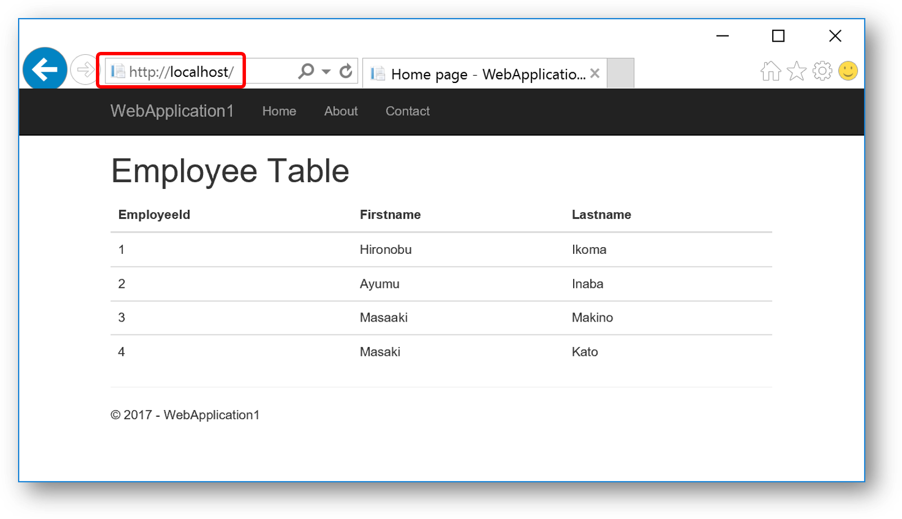


## 負荷分散の構成

ここまでの設定では Web サーバー 1号機と2号機はそれぞれ独立したパブリック IP アドレスを持っていますので、インターネットからの利用者はアクセス先のサーバーを意識して IP アドレスを明示的に指定しなければなりません。
以降では Azure Load Balancer を使用して Web サーバー 1号機と2号機による負荷分散を構成します。

### Azure Load Balancer の作成

#### バックエンドプール
#### プローブ
#### 負荷分散ルール

### FQDN によるアクセス


## 補足

