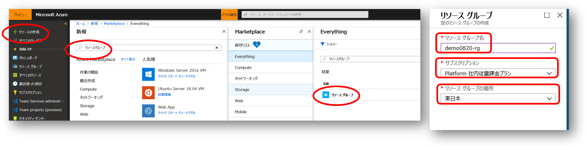

# IaaS で作る Web+DB システム（ハンズオン）

## リソースグループの作成

Azure ポータルの「リソースの作成」より「リソースグループ」を検索し、リソーグループを作成します。

- リソースグループ名
    - 現在作業中の環境が複数人で共用する、本ハンズオン以外の他の用途にも使用するなどの場合、リソースグループ名は日付や自分の名前を含めるなどして区別がつきやすいようにすることをおススメします。
- サブスクリプション
    - 本ハンズオンのこの作業を進めていくと仮想マシン等の有料のリソースを作成しますので、使っても良いサブスクリプションが選択されているか確認しましょう。
- リソースグループの場所
    - ここでは任意のリージョンを選択しても構いません。

## 仮想ネットワークの作成

Azure ポータルの「リソースの作成」、もしくは、先ほど作成したリソースグループの「追加」より、仮想ネットワークを作成します。

- 名前
    - この先の操作で仮想ネットワークは良く出てきますので、分かりやすい名前を付けましょう
- アドレス空間
    - ここでは CIDR 表記で /24 bit 程度 のアドレス空間を定義します。プライベートアドレス空間を使用しましょう。
- サブスクリプション
    - 適切なサブスクリプションが選択されていることを確認しましょう。
- リソースグループ
    - 「既存のものを使用」を選択し、先ほど作成したリソースグループを選択します。
- 場所
    - ここでは適切なリージョン、すなわち、システムを稼働させるリージョンを選択します。リソースグループと異なるリージョンを選択しても構いません。
- サブネット
    - 上述のアドレス空間の中から複数のサブネットを切ることが出来ます。ここでは Web サーバー用のサブネットとして /27 bit のサブネットを作成しています。

### サブネットの追加

先ほど作成した仮想ネットワークを選択し、「サブネット」タブを選択すると、既にWebサーバー用のサブネットが作成されていることが確認できます。
ここでDB サーバー用の新しいサブネットとして /27 bit アドレス範囲のサブネットを追加します。

以降ではここで作成した仮想ネットワーク内の各サブネット内に仮想マシンを作成していきます。

## 仮想マシンの作成

ここでは Web サーバーを2台、DB サーバーを 1台作成します。
仮想マシンの作成には数分程度の時間がかかりますので、先に Azure ポータルからの作成作業を済ませてしまい、
その後で各サーバー内のソフトウェア構成作業を行うと良いでしょう。

### Webサーバー用 Windows 仮想マシンの作成

### Webサーバー用 Linux 仮想マシンの作成

### DBサーバー用 SQL Server インストール済み仮想マシンの作成

