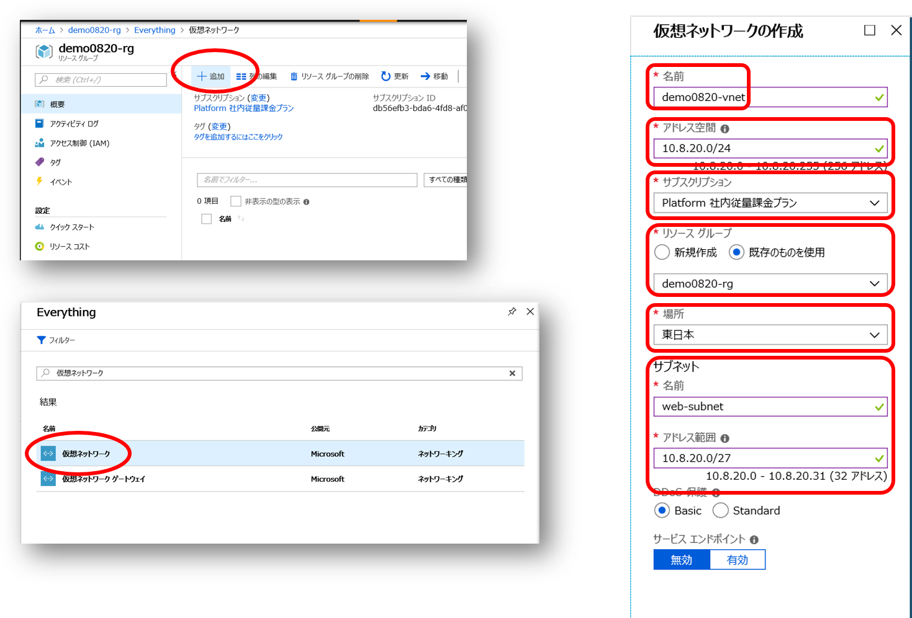

# IaaS で作る Web+DB システム（ハンズオン）

## リソースグループの作成

Azure ポータルの「リソースの作成」より「リソースグループ」を検索し、リソーグループを作成します。

- リソースグループ名
    - 現在作業中の環境が複数人で共用する、本ハンズオン以外の他の用途にも使用するなどの場合、リソースグループ名は日付や自分の名前を含めるなどして区別がつきやすいようにすることをおススメします。
- サブスクリプション
    - 本ハンズオンのこの作業を進めていくと仮想マシン等の有料のリソースを作成しますので、使っても良いサブスクリプションが選択されているか確認しましょう。
- リソースグループの場所
    - ここでは任意のリージョンを選択しても構いません。

## 仮想ネットワークの作成

Azure ポータルの「リソースの作成」、もしくは、先ほど作成したリソースグループの「追加」より、仮想ネットワークを作成します。

- 名前
    - この先の操作で仮想ネットワークは良く出てきますので、分かりやすい名前を付けましょう
- アドレス空間
    - ここでは CIDR 表記で /24 bit 程度 のアドレス空間を定義します。プライベートアドレス空間を使用しましょう。
- サブスクリプション
    - 適切なサブスクリプションが選択されていることを確認しましょう。
- リソースグループ
    - 「既存のものを使用」を選択し、先ほど作成したリソースグループを選択します。
- 場所
    - ここでは適切なリージョン、すなわち、システムを稼働させるリージョンを選択します。リソースグループと異なるリージョンを選択しても構いません。
- サブネット
    - 上述のアドレス空間の中から複数のサブネットを切ることが出来ます。ここでは Web サーバー用のサブネットとして /27 bit のサブネットを作成しています。

### サブネットの追加

先ほど作成した仮想ネットワークを選択し、「サブネット」タブを選択すると、既にWebサーバー用のサブネットが作成されていることが確認できます。
ここでDB サーバー用の新しいサブネットとして /27 bit アドレス範囲のサブネットを追加します。

以降ではここで作成した仮想ネットワーク内の各サブネット内に仮想マシンを作成していきます。

## 仮想マシンの作成

ここでは Web サーバーを2台、DB サーバーを 1台作成します。
仮想マシンの作成には数分程度の時間がかかりますので、先に Azure ポータルからの全ての仮想マシン作成作業を済ませてしまい、
その後で各サーバー内のソフトウェア構成作業を行うと良いでしょう。

### Webサーバー用 Windows 仮想マシンの作成

先ほど作成したリソースグループの「追加」より、仮想マシンを追加します。ここではマーケットプレイスにセットアップ済みイメージが提供されている Windows Server 2016 を使用します。

)

選択した仮想マシンイメージに応じて構成画面が用意されているので必要事項を入力します。

- 基本
    - Windows にログオンするための管理者のユーザー名とパスワードを指定します。後程リモートデスクトップで接続するので忘れないようにしましょう。
    - サブスクリプション、リソースグループ、場所、はこれまで作成してきたものと一致させてください。
- サイズ
    - それほど高スペックを求められるわけでもないので、ここでは料金の安い Bシリーズを選択しています。
- 設定
    - ここで可用性セットを新規に作成します。もう一台の Web サーバーで同じものを使うのでわかりやすい名前を付けてください。障害ドメインや更新ドメインは既定値のままで問題ありません。
    - 仮想ネットワークやサブネットには前述の手順で作成したものを選択します。
    - パブリック IP アドレスを新規に作成することで、インターネット経由で仮想マシンに接続することができますが、管理操作に使用するリモートデスクトップ用のプロトコルが通るようにネットワークセキュリティグループを構成します。

構成の検証の後に仮想マシンの作成が開始されますが、数分程度は時間がかかってしまうので、他の仮想マシンも並行して作成してしまいましょう。

### Webサーバー用 Linux 仮想マシンの作成

### DBサーバー用 SQL Server インストール済み仮想マシンの作成

## Web サーバー用 Windows 仮想マシンの構成

## Web サーバー用 Linux 仮想マシンの構成

## DB サーバー用の Windows 仮想マシンの構成

