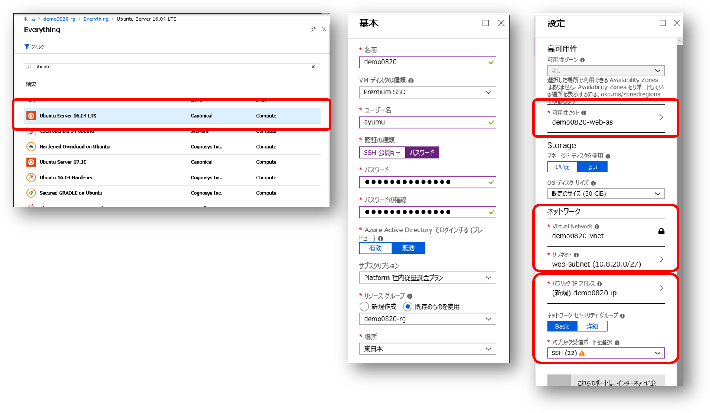

# IaaS で作る Web+DB システム

本ドキュメントは Azure 初学者向けハンズオン用の資料です。勉強のために実際のシステム構築では通常は行わないような構成・作業手順を行っている場合があります。

## リソースグループの作成

Azure ポータルの「リソースの作成」より「リソースグループ」を検索し、リソーグループを作成します。


- リソースグループ名
    - 現在作業中の環境が複数人で共用する、本ハンズオン以外の他の用途にも使用するなどの場合、リソースグループ名は日付や自分の名前を含めるなどして区別がつきやすいようにすることをおススメします。
- サブスクリプション
    - 本ハンズオンのこの作業を進めていくと仮想マシン等の有料のリソースを作成しますので、使っても良いサブスクリプションが選択されているか確認しましょう。
- リソースグループの場所
    - ここでは任意のリージョンを選択しても構いません。


## 仮想ネットワークの作成

Azure ポータルの「リソースの作成」、もしくは、先ほど作成したリソースグループの「追加」より、仮想ネットワークを作成します。


- 名前
    - この先の操作で仮想ネットワークは良く出てきますので、分かりやすい名前を付けましょう
- アドレス空間
    - ここでは CIDR 表記で /24 bit 程度 のアドレス空間を定義します。プライベートアドレス空間を使用しましょう。
- サブスクリプション
    - 適切なサブスクリプションが選択されていることを確認しましょう。
- リソースグループ
    - 「既存のものを使用」を選択し、先ほど作成したリソースグループを選択します。
- 場所
    - ここでは適切なリージョン、すなわち、システムを稼働させるリージョンを選択します。リソースグループと異なるリージョンを選択しても構いません。
- サブネット
    - 上述のアドレス空間の中から複数のサブネットを切ることが出来ます。ここでは Web サーバー用のサブネットとして /27 bit のサブネットを作成しています。


### サブネットの追加

先ほど作成した仮想ネットワークを選択し、「サブネット」タブを選択すると、既にWebサーバー用のサブネットが作成されていることが確認できます。
ここでDB サーバー用の新しいサブネットとして /27 bit アドレス範囲のサブネットを追加します。


以降ではここで作成した仮想ネットワーク内の各サブネット内に仮想マシンを作成していきます。

## 仮想マシンの作成

ここでは Web サーバーを2台、DB サーバーを 1台作成します。
仮想マシンの作成には数分程度の時間がかかりますので、先に Azure ポータルからの全ての仮想マシン作成作業を済ませてしまい、
その後で各サーバー内のソフトウェア構成作業を行うと良いでしょう。

### Webサーバー 1号機用 Windows 仮想マシンの作成

先ほど作成したリソースグループの「追加」より、仮想マシンを追加します。ここではマーケットプレイスにセットアップ済みイメージが提供されている Windows Server 2016 を使用します。


選択した仮想マシンイメージに応じて構成画面が用意されているので必要事項を入力します。


- 基本
    - Windows にログオンするための管理者のユーザー名とパスワードを指定します。後程リモートデスクトップで接続するので忘れないようにしましょう。
    - サブスクリプション、リソースグループ、場所、はこれまで作成してきたものと一致させてください。
- サイズ
    - それほど高スペックを求められるわけでもないので、ここでは料金の安い Bシリーズを選択しています。
- 設定
    - ここで可用性セットを新規に作成します。もう一台の Web サーバーで同じものを使うのでわかりやすい名前を付けてください。障害ドメインや更新ドメインは既定値のままで問題ありません。
    - 仮想ネットワークやサブネットには前述の手順で作成したものを選択します。
    - パブリック IP アドレスを新規に作成することで、インターネット経由で仮想マシンに接続することができますが、管理操作に使用するリモートデスクトップ用のプロトコルが通るようにネットワークセキュリティグループを構成します。

構成の検証の後に仮想マシンの作成が開始されますが、数分程度は時間がかかってしまうので、他の仮想マシンも並行して作成してしまいましょう。

### Webサーバー 2号機用 Linux 仮想マシンの作成

作成手順は基本的に Windows 版の仮想マシンと同じですが、ここではマーケットプレイスに公開されているイメージから Ubuntu Server を選択しています。



- 認証
    - Linux 仮想マシンの場合はパスワードではなく SSH キーを使用した認証も可能です。
- 可用性セット
    - 可用性セットは新規に作成せず、Web サーバー1号機の構築時に作成した可用性セットを選択します。
- ネットワークセキュリティグループ
    - ２号機は Windows ではなく Ubuntu Linuxなので、管理操作に使用する SSH プロトコルが通るように ネットワークセキュリティグループを構成します。

### DBサーバー用 SQL Server インストール済み仮想マシンの作成

作成手順は基本的に Web サーバー用の仮想マシンと同じですが、ここではマーケットプレイスに公開されているイメージから SQL Server がインストールされた Windows Server イメージを選択しています。自分で SQL Server をインストールする手間が無いので構築作業がかなり楽になります。


- 可用性セット
    - ここでは Web サーバー用途は異なる、新規の可用性セットを作成します。
- パブリック IP アドレス
    - DB サーバーはパブリック IP アドレスを割り当てません。
- ネットワークセキュリティグループ
    - パブリック IP アドレスを割り当てていませんので、ここでは 受信ポートも公開しません。
- SQL Server の設定
    - Windows Server 2016 用の仮想マシンイメージとは異なり、ここでは SQL Server をインストーする際の設定項目を指定することができます。
    - ここでは SQL 認証を有効にして、SQL ServerへのログインユーザーIDとパスワードを指定しています（Windows へログインする際のID／パスワードとは変えておくと良いでしょう）

### ここまでの作業内容の確認

リソースグループを参照すると、仮想マシンだけではない多数のリソースが作成されていることが分かります。


また仮想ネットワークを確認すると、ネットワークに接続された仮想マシンが確認できます（ネットワークインタフェースを介して接続しています）


### Web サーバー 1号機用 Windows 仮想マシンの構成

Azure 仮想マシンとしての構築が完了したら、仮想マシン内部のソフトウェアを構成します。Web サーバー 1 号機はパブリック IP アドレスを割り当て、リモートデスクトップ接続用のポートを開放しているので、インターネット経由で通常のリモートデスクトップクライアントを使用して接続することが可能です。


Azureポータル上で仮想マシンの「パブリック IP アドレス」を確認し、リモートデスクトップクライアントのコンピュータ名として入力します。資格情報には構築時に入力したユーザーIDとパスワードを使用すると、通常のWindows サーバーのように操作が可能になります。

#### IIS のインストール
まずは Web サーバーとして構成するために IIS （Internet Information Service）をインストールします。まずPowerShell を起動して以下のコマンドを実行します。

```
PS > Install-WindowsFeature -Name Web-Server
```
インストールが完了したら正常に稼働していることを確認しましょう。以下のコマンドを実行すると Internet Explorer が起動して IIS の初期画面が表示されます。
```
PS > start http://localhost
```


#### ASP.NET のインストール
次にアプリケーションサーバとして構成するためにミドルウェアの導入を行います。ここでは ASP.NET Core ベースのアプリケーションを構築するとしてて、
[こちら](https://www.microsoft.com/net/download/dotnet-core/runtime-2.0.7)
から v2.0.7 の Windows 版 ASP.NET Core Runtime & Hosting Bundle をダウンロードおよびインストールします。
インストールが完了したら念のため IIS を再起動しておきましょう。
```
PS > iisreset
```


#### アプリケーションのインストール


### Web サーバー用 Linux 仮想マシンの構成

### DB サーバー用の Windows 仮想マシンの構成

