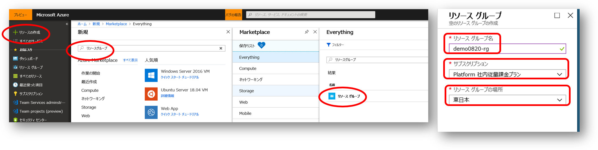
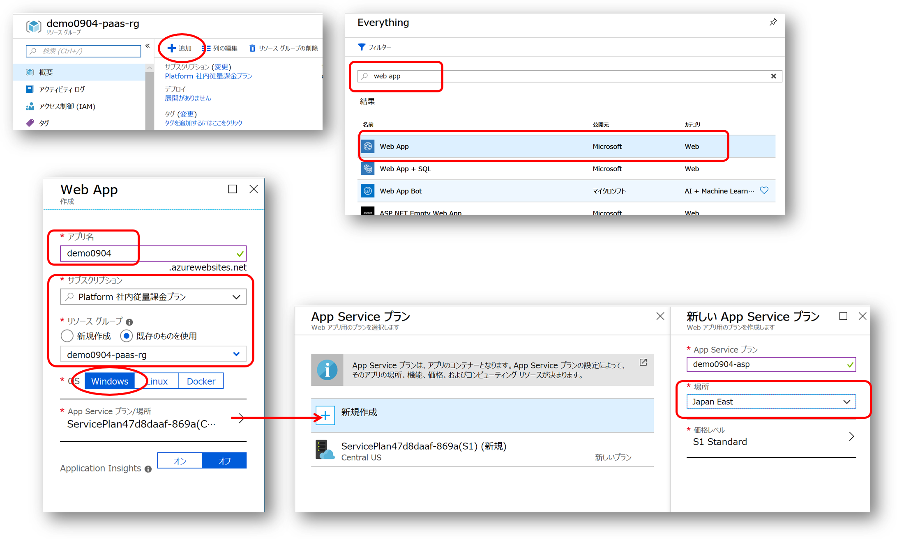
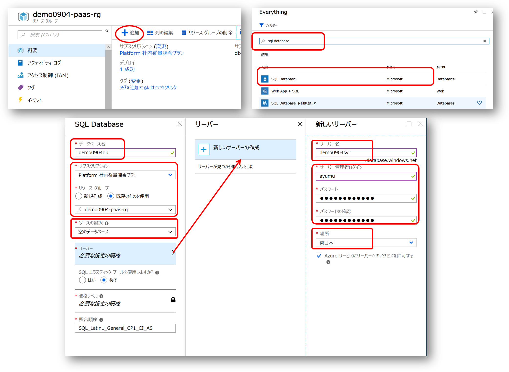
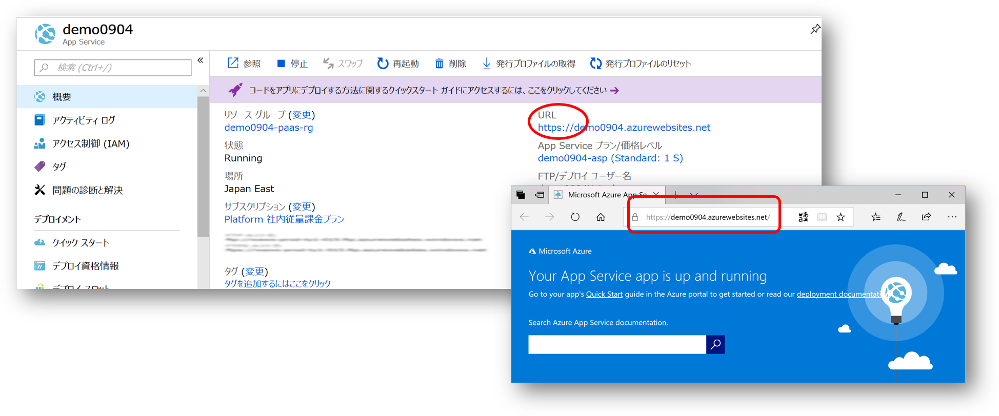
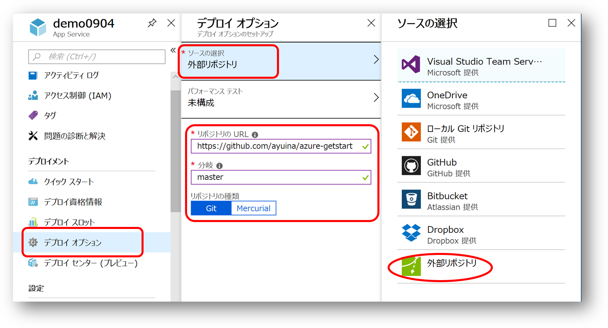
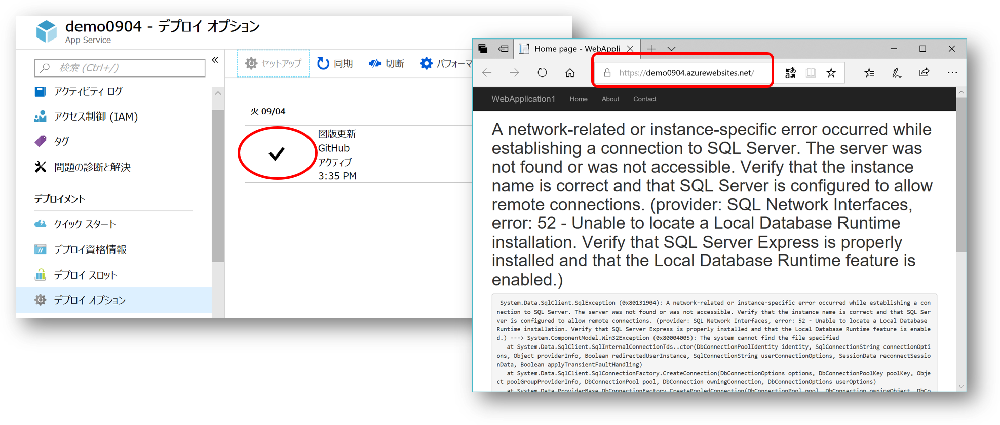

# PaaS で作る Web+DB システム

本ドキュメントは Azure 初学者向けハンズオン用の資料です。学習用のために実際のシステム構築では通常は行わないような構成・作業手順を行っている場合があります。


## リソースグループの作成

Azure ポータルの「リソースの作成」より「リソースグループ」を検索し、リソーグループを作成します。



- リソースグループ名
    - 現在作業中の環境が複数人で共用する、本ハンズオン以外の他の用途にも使用するなどの場合、リソースグループ名は日付や自分の名前を含めるなどして区別がつきやすいようにすることをおススメします。
- サブスクリプション
    - 本ハンズオンのこの作業を進めていくと Web App 等の有料のリソースを作成しますので、使っても良いサブスクリプションが選択されているか確認しましょう。
- リソースグループの場所
    - ここでは任意のリージョンを選択しても構いません。

## Web App の作成

マーケットプレイスから "Web App" を検索して作成します。



- アプリ名
    - ここで指定した名前が Web App にアクセスする際の FQDN 名になるのでユニークになるように名付ける必要があります。
- サブスクリプションとリソースグループ
    - ハンズオンに使用するサブスクリプション、および作成したリソースグループを選択します。
- OS
    - 本ハンズオンでは Windows の Web App を使用します。
- App Service プラン
    - （既定のモノではなく）新規に作成し、その際に Web App をホストしたい Azure リージョンを選択します。

Web App の作成が完了するまでには多少時間がかかるので、待っている間に並行して SQL Database の作成作業を進めてください。

## SQL Database の作成

マーケットプレイスから "SQL Database" を検索して作成します。



- データベース名
    - アプリケーションからアクセスするためのデータベースの名前を付けます。
- サブスクリプションとリソースグループ
    - ハンズオンに使用するサブスクリプション、および作成したリソースグループを選択します。
- ソースの選択
    - テーブル定義やデータは別途構築するためここでは "空のデータベース" を選択します
- サーバー
    - データベースをホストするサーバーを新しく作成します。
    - サーバー名は FQDN の一部となりますのでユニークになるように名付けてください。
    - サーバー管理者のログイン ID とパスワードを入力します
    - 場所として Web App と同じリージョンを選択します。

SQL Database の作成が完了するまでには多少時間がかかるので、待っている間に並行して Web App へアプリケーションをデプロイする作業を進めてください。

## Web App へアプリケーションのデプロイ

まずは Web App が正しく構築出来ているか動作確認をします。作成した Web App の画面で URL 欄のハイパーリンクを開くと既定の Web ページが出来上がっていることが確認できます。



この既定の Web ページをアプリケーションで置き換えてやればよいわけです。コンテンツを FTP でアップロードする昔ながらのやり方も可能ですが、ここではソースコード管理システムでメンテナンスされている正規のソースコードをデプロイする方式で行います。

### Github アカウントを持っている場合


### Github アカウントを持っていない場合

Web App のメニューで "デプロイオプション" を選択します。デプロイするアプリケーションのソースコード管理システムに応じてソースを選択しますが、ここでは "外部リポジトリ" を選択します。



本ドキュメントが管理されている GitHub リポジトリにはアプリケーションのソースコードも格納されていますので、これをそのまま Web App にデプロイしてしまいます。
Git プロトコルのクローン URL は以下のようになります。
```
https://github.com/ayuina/azure-getstart.git
```
ブランチは `master` を指定し、リポジトリの種類として `Git` を指定します。


### 動作確認

アプリケーションのデプロイが完了するまで少し時間がかかりますが、完了するとデプロイオプションの画面にチェックマークが表示されます。
先ほど稼働確認をした場合と同様に Web App の URL を表示すると、今度はアプリケーションの画面が表示されます。



SQL Server への接続エラーが表示されますが、別途構築した SQL Database 側のセットアップを完了していないので、この段階では問題ありません。

### SQL Database の接続文字列を設定

### 動作確認

この時点ではエラー

## SQL Database へのデプロイ

### テーブルとデータの投入

### ファイアーウォールの構成

## 最終確認

業務データが表示される

### CI/CD の確認


## 後片付け


