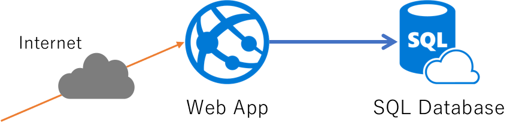

# PaaS で作る Web+DB システム

本ドキュメントは Azure 初学者向けハンズオン用の資料です。学習用のために実際のシステム構築では通常は行わないような構成・作業手順を行っている場合があります。

## リソースグループの作成

Azure ポータルの「リソースの作成」より「リソースグループ」を検索し、リソーグループを作成します。

- リソースグループ名
    - 現在作業中の環境が複数人で共用する、本ハンズオン以外の他の用途にも使用するなどの場合、リソースグループ名は日付や自分の名前を含めるなどして区別がつきやすいようにすることをおススメします。
- サブスクリプション
    - 本ハンズオンのこの作業を進めていくと仮想マシン等の有料のリソースを作成しますので、使っても良いサブスクリプションが選択されているか確認しましょう。
- リソースグループの場所
    - ここでは任意のリージョンを選択しても構いません。

## Web App の作成

## SQL Database の作成

## Web App へアプリケーションのデプロイ

### Github アカウントを持っている場合

### Github アカウントを持っていない場合

### SQL Database の接続文字列を設定

### 動作確認

この時点ではエラー

## SQL Database へのデプロイ

### テーブルとデータの投入

### ファイアーウォールの構成

## 最終確認

業務データが表示される

### CI/CD の確認

## 後片付け

